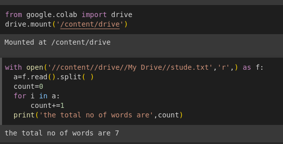
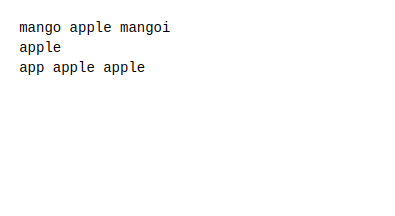

# Word-count
## AIM:
To write a python program for getting the word count from a text.
## EQUIPEMENT'S REQUIRED: 
PC
Anaconda - Python 3.7
## ALGORITHM: 
### Step 1:
Mount your colab with your drive
### Step 2: 
Open your text file in python code runner 
### Step 3: 
Read the file and split the words separately using split()
### Step 4:  
Count the number of words in text file using for loop
### Step 5: 
End the program
 

## PROGRAM:
```python

from google.colab import drive
drive.mount('/content/drive')

with open('//content//drive//My Drive//stude.txt','r',) as f:
  a=f.read().split( )
  count=0
  for i in a:
      count+=1
  print('the total no of words are',count)
```

### OUTPUT:
 #program code with output



#text file



## RESULT:
Thus the program is written to find the word count from a text.
